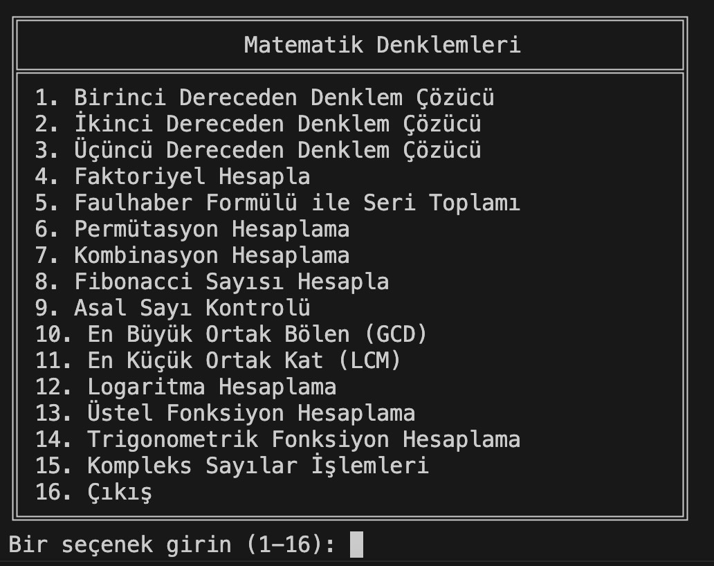

# proje1
Popüler Matematik Denklemlerini Çözen Konsol Uygulaması

 
  Bu uygulama, doğrusal, ikinci dereceden ve üçüncü dereceden denklemleri çözme, faktöriyel hesaplama, seri toplamı, permütasyon ve kombinasyon hesaplama, Fibonacci sayıları, asal sayıları kontrol etme, EBOB ve EKOK hesaplama, logaritma ve üstel fonksiyon hesaplama, trigonometrik fonksiyonlar ve kompleks sayı işlemleri gibi çeşitli matematiksel fonksiyonlar içermektedir. `menu` fonksiyonu, bu işlemleri interaktif olarak erişmek için kullanıcı dostu bir arayüz sunar.

 
 

  Kompleks sayılara ilişkin işlemler için ayrıca bir alt menü bulunmaktadır.

